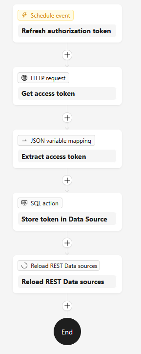
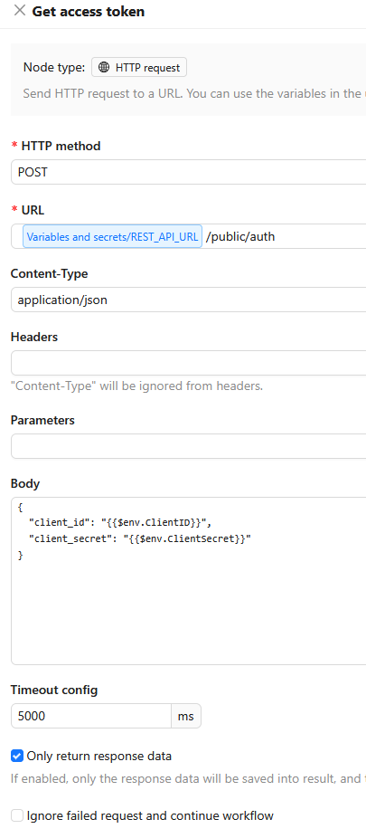
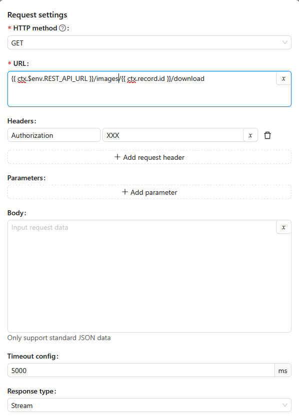

# NocoBase workflow plugin: reload data sources

This plugin is a complement to the [NocoBase REST API data source plugin](https://docs.nocobase.com/data-sources/data-source-rest-api/). The REST API plugin does not have native support for OAuth2 for REST API data sources, though this will be probably be remedied in future releases. To solve this, the NocoBase workflow functionality can be leveraged to periodically request a new access token and update the data source authorization header directly in the database. For the token to become live, the workflow must also reload the data source. This plugin provides a Workflow action that does that as part of the update.

## OAUTH2 token refresh use case

Here is a example of how the refresh workflow can look. It has a `Schedule event` trigger type, which should be set to run more often than the lifetime of the generated access token.

| Workflow | HTTP Request action |
| --- | --- |
|  |  |

1. **HTTP Request action:** The workflow requests a new OAuth2 access token. The client ID and secret used for the exchange should be stored as secrets under "Variables and secrets", and not hardcoded in the action.

2. **JSON variable mapping:** Extract the access token from the response so it is available for later actions.

3. **SQL action:** Update the data source authorization header directly in the Main database using this query:

   ```sql
   UPDATE "dataSources"
   SET options =
     jsonb_set(
       options::jsonb,
       '{headers}',
       (
         SELECT jsonb_agg(
                  CASE
                    WHEN h->>'name' = :header
                      THEN jsonb_set(h, '{value}', to_jsonb(:value::text), false)
                    ELSE h
                  END
                )
         FROM jsonb_array_elements((options->'headers')::jsonb) AS h
       ),
       false
     )
   WHERE key = :key;
   ```

   Here, `key`, `header`, and `value` are the query parameters, where `key` is the machine name of the data source.

4. **Reload REST data sources:** Use this plugin to reload the data source so the new token takes effect.

## Custom requests use case

The plugin can also be used when creating NocoBase [Custom requests](https://docs.nocobase.com/interface-builder/actions/types/custom-request) to external APIs or third-party services that require OAuth2 authentication. A regular [JS Action](https://docs.nocobase.com/interface-builder/actions/types/js-action) cannot be used since it exposes the tokens to the client, whereas Custom requests run server-side.

Let's assume the custom request is to the same service as the one above. Add a second SQL action to the workflow to update the custom request authorization header directly in the Main database using this query:

   ```sql
   UPDATE "customRequests"
   SET options = jsonb_set(
   options::jsonb,
   '{headers}',
   (
       SELECT jsonb_agg(
       CASE
           WHEN h->>'name' = :header
           THEN jsonb_set(h, '{value}', to_jsonb(:value::text), false)
           ELSE h
       END
       )
       FROM jsonb_array_elements((options::jsonb->'headers')) AS h
   ),
   false
   )
   WHERE key = :key;
   ```

   Here, `key`, `header`, and `value` are the query parameters as before, where key is the machine name of the custom request.



## Installation

1. Download the tgz file from the repo.

2. Click on the "Add & Update" button in the Plugin Manager and select the "Upload plugin" tab and upload the tgz file.

3. Enable the plugin.

### APP_CLIENT_ENTRY_MODE issue

At this time, if the [APP_CLIENT_ENTRY_MODE](https://www.nocobase.com/en/blog/2.2.0) environment variable is set, then the option to upload the plugin may or may not be available in the Plugin Manager. Here are the workarounds depending on the value of the parameter setting:

* `legacy-default`: No workaround needed.
* `modern-default`: Change the Plugin Manager URL path from the modern `https://<domainname>/v/admin/settings/plugin-manager` to legacy `https://<domainname>/admin/settings/plugin-manager` (i.e. remove `\v` from the path).
* `modern-only`: Change to `modern-default` and use that workaround.
